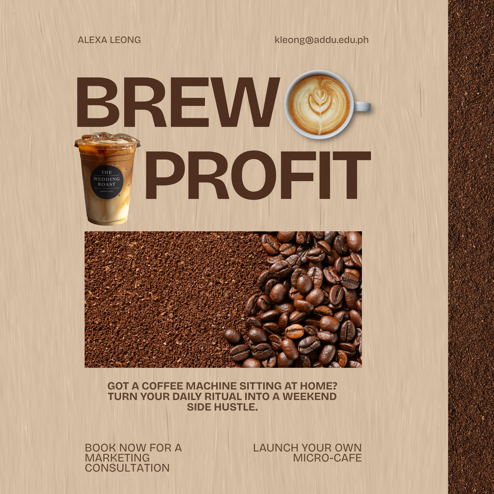

# GE-IT-Skills-Portfolio
A beginner-friendly developer portfolio with a brown palette aesthetic.

## Professional Bio & Branding Tagline
**_Transforming corporate strategy into powerful brand stories that connect, inspire, and drive growth._**
### Designs Sneak Peak 👀

I utilized a warm, brown color palette to give the interface a cozy, coffee-shop aesthetic that instantly feels welcoming to visitors. I also incorporated clean typography and plenty of whitespace to ensure the layout remains modern and highly readable. The goal was to blend the cozy ambiance of a cafe with a seamless digital presence.
